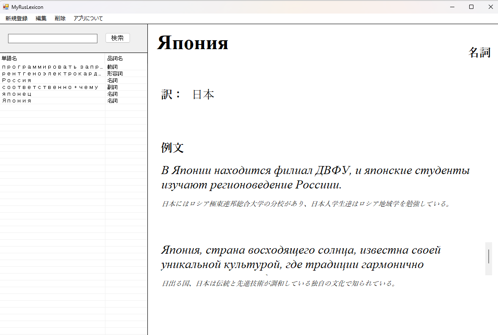
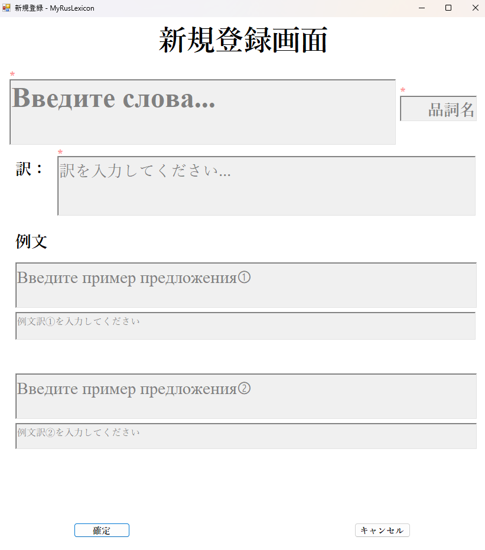
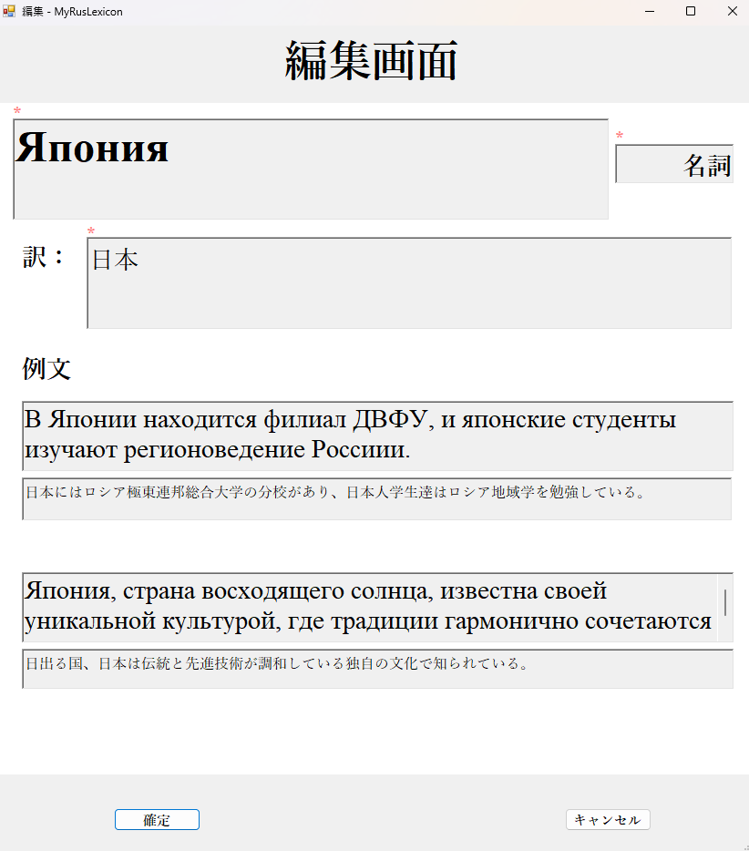
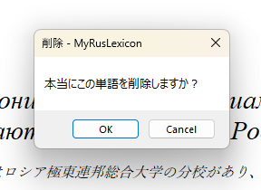

# MyRusLexicon
> ロシア語を勉強するすべての人に

## 概要
MyRusLexiconは、初級者や上級者といったレベルに区別されず、辞書などの長々しく重苦しい書物から解放され、ロシア語を学びたい人に魅力的な単語帳ツールです。  
このツールには以下の機能が含まれています。  
なお、アプリ起動初期は参考として何個かのテンプレートが入っています。  
※画面はすべて開発途中のものです

  
## 特徴
### 1. 単語登録機能
例えば、ロシア映画を鑑賞している時、ロシア語の歌を聞き流している時、ドストエフスキーやトルストイなどの文豪が書いた小説に感銘している時には、必ず知らない単語が出てくると思います。  
そのようなときに例文を登録できる自分の辞書があったら便利だと思いませんか？  
MyRusLexiconでは単語とその訳、品詞名、例文と例文訳を2つまで登録することが可能です！  
単語データをデータベース化することによって、アプリを再起動したら消えてしまうなんてことはありません。  

  
### 2. 単語編集機能
辞書で単語や例文を編集することは、当然できません。  
しかし、MyRusLexiconでは単語を単語帳のように編集することはもちろん、例文も自身の面白いものにアップデートすることができます！  

  
### 3. 削除機能
日本語より単語数の多いロシア語を覚えていくには、大変な労力と時間がかかります。  
そんなときは思い切って正直要らない単語を消してしまいましょう！  

  
  
## 仕様技術
・言語: C#  
・データベース: SQLite  
・開発環境: Visual Studio  
・開発者: Inari Goro  

## 動作環境
・Windows10以降を想定  
・.NET Framework

## 今後の予定
・古臭いUIデザインの大幅改良  
・ロシア語独自の品詞名によるソート機能  
・AIによる例文作成及びロシア語例文の文法チェック機能の実装
